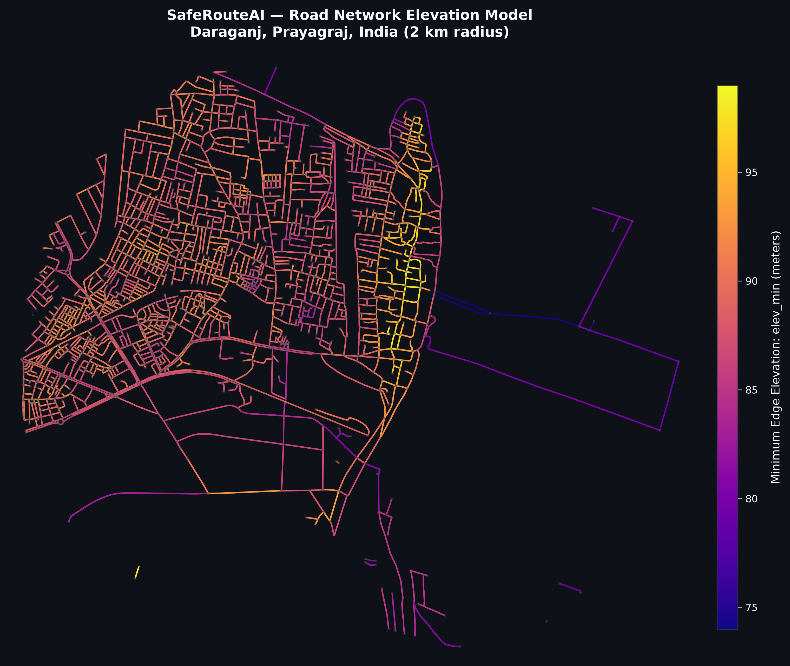
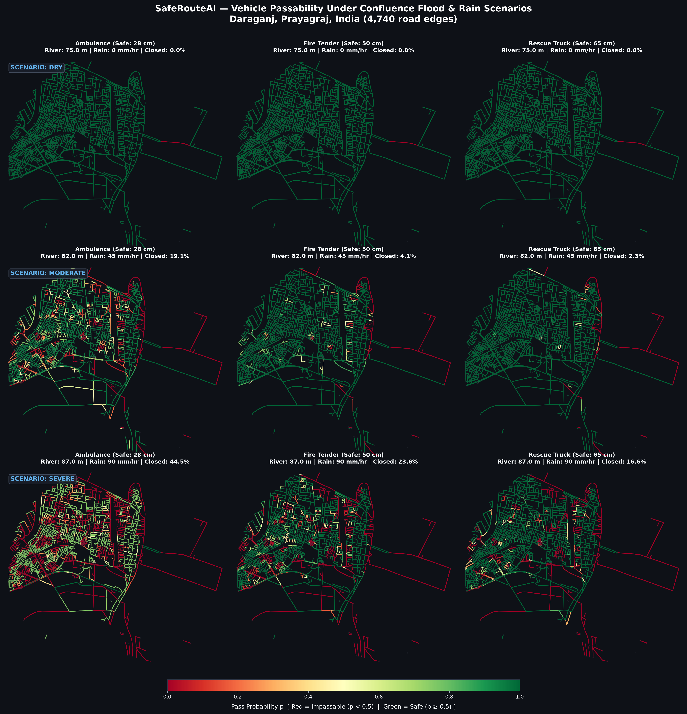

# SafeRouteAI

**Dynamic Flood-Resilient Emergency Vehicle Routing System**  
*Study Area: Daraganj, Prayagraj, India (Ganga–Yamuna Confluence)*

---

## 1. Project Overview

SafeRouteAI is a predictive emergency-routing engine built for flood-prone urban environments. Located at the holy Sangam confluence in Prayagraj, Daraganj experiences acute monsoon flood risks driven by regional river stage rises on the Ganges and Yamuna combined with intense localized rainfall ponding.

Standard navigation systems route vehicles along geometrically shortest paths, often directing emergency responders straight through low-lying roads or flooded depressions. SafeRouteAI models elevation-driven flood depths, computes soft logistic passability probabilities tailored to specific emergency vehicle wading limits, and generates reliable, risk-minimized detour routes.

---

## 2. Collaboration & Branching Strategy

This project is co-developed using a modular Git branching workflow:

| Branch | Focus Area | Responsibility | Status |
| :--- | :--- | :--- | :--- |
| **`main`** | Stable Baseline | Shared stable releases, regression-tested core algorithms, and cached inputs | **Active Baseline** |
| **`routing`** | Phase 3 Backend | Risk-aware pathfinding (Dijkstra/A*), travel times, backup routes, and baseline comparisons | *Upcoming Feature Branch* |
| **`ui`** | Phase 4 Frontend | Interactive Streamlit dashboard + Folium web map with rainfall/river stage sliders | *Upcoming Feature Branch (Collaborator)* |

### Collaboration Rules
1. `main` always remains functional with verified regression outputs.
2. The backend routing engine will be developed and tested in `routing` before merging into `main`.
3. The Streamlit + Folium dashboard will be developed in `ui`, consuming the `saferoute` package API (`passability()`, `compute_depths()`, etc.).

---

## 3. Implementation Status

- [x] **Phase 1: Road Network Ingestion & Elevation Enrichment**
  - Downloaded drivable road network within $2\text{ km}$ of Daraganj ($1,823$ nodes, $4,740$ edges).
  - OpenTopoData SRTM 30m batch fetching with rate limiting and automatic 90m fallback.
  - Multi-pass topological neighbor averaging for null elevation filling.
  - GraphML persistence with float type casting (`data/graph.graphml`).
- [x] **Phase 2: Hydrodynamic Flood Risk & Passability Model**
  - Robust bridge classifier handling multi-value and stringified OSM tags ($20$ bridges identified).
  - Topographic depression computation within $300\text{ m}$ radius cached in `data/depressions.pkl`.
  - Regional riverine stage and rainfall depression ponding depth calculation.
  - Soft-threshold logistic sigmoid passability probability for Ambulance ($28\text{ cm}$), Fire Tender ($50\text{ cm}$), and Rescue Truck ($65\text{ cm}$).
  - Invariant sanity assertions (non-negative depths, rainfall/river monotonicity).
- [ ] **Phase 3: Risk-Aware Router & Benchmark Evaluation** *(Branch `routing`)*
  - Strongly connected component extraction and parallel edge collapsing.
  - Hydrodynamic travel time calculations with water slowdown.
  - Additive log-risk Dijkstra router ($\text{cost} = \text{time} + \lambda (-\ln p)$).
  - Primary, backup, and baseline shortest path evaluation.
- [ ] **Phase 4: Interactive Dashboard** *(Branch `ui`)*
  - Streamlit application with river level and rainfall sliders.
  - Folium interactive geospatial map with color-coded passability layers.

---

## 4. Directory Structure

```text
SafeRouteAI/
├── saferoute/
│   ├── __init__.py      # Package interface & public exports
│   ├── config.py        # Centralized configuration (constants, vehicle limits, slider bounds)
│   ├── data.py          # Phase 1: Network ingestion, SRTM elevation fetching, GraphML caching
│   ├── risk.py          # Phase 2: Bridge classification, depressions, depths, passability()
│   ├── routing.py       # Phase 3: Risk-aware router (stub ready for routing phase)
│   └── viz.py           # Cartography: elevation map, 3x3 scenario matrix, route plots
├── scripts/
│   ├── run_data.py      # Entry point: Ingestion, elevation enrichment, and network map
│   └── run_risk.py      # Entry point: Sanity assertions, scenario passability table, and 3x3 grid
├── data/
│   ├── graph.graphml            # Cached drivable network with node/edge elevations
│   ├── elevations.json          # Cached node ID -> elevation mapping (OpenTopoData)
│   ├── depressions.pkl          # Cached edge topographic depressions (300m radius)
│   ├── elevation_network.png    # Reference plot: Road network elevation model
│   └── passability_3x3_grid.png # Reference plot: 3x3 scenario passability grid
├── README.md            # Project documentation & guide
├── requirements.txt     # Production dependencies
└── .gitignore           # Ignored files (.venv, __pycache__, test plots, logs)
```

---

## 5. Mathematical & Physical Models

### A. Flood Water Depth Calculation
For any road segment $e$:
$$\text{depth}_{\text{total}} = \text{depth}_{\text{riverine}} + \text{depth}_{\text{rain}} \quad (\text{cm})$$

1. **Riverine Flooding**:
   $$\text{depth}_{\text{riverine}} = \max(0,\, \text{river\_level} - \text{elev\_min}) \times 100 \quad (\text{cm})$$
   *Note*: This represents a regional stage elevation simplification (low-lying roads below river stage are subject to backwater inundation without requiring full 2D mesh solvers).
2. **Rainfall Depression Ponding**:
   $$\text{depression}_e = \max\left(0,\, \overline{\text{elev\_min}}_{r \le 300\text{m}} - \text{elev\_min}_e\right) \quad (\text{m})$$
   $$\text{depth}_{\text{rain}} = k \times \text{rainfall\_mm\_hr} \times (1 + \text{depression}_e) \quad (\text{cm})$$
   - $k = 0.25$ (tunable constant in `saferoute/config.py`).
3. **Bridges Exemption**:
   - Tagged bridge structures (`bridge != 'no'`) skip the depth formula ($\text{depth} = 0\text{ cm}$) unless the river level exceeds approach node elevations by more than $1.0\text{ m}$ (overtopping condition).

### B. Soft Threshold Vehicle Pass Probability
Emergency vehicles have differing safe wading capabilities:
- **Ambulance**: $28\text{ cm}$
- **Fire Tender**: $50\text{ cm}$
- **Rescue Truck**: $65\text{ cm}$

Pass probability is evaluated via a logistic sigmoid with softness parameter $s = 5.0\text{ cm}$:
$$p = \frac{1}{1 + \exp\left(\frac{\text{depth}_{\text{cm}} - \text{safe\_depth}_{\text{cm}}}{s}\right)}$$
- $\text{depth} \ll \text{safe\_depth} \implies p \approx 1.0$ (Safe / Green)
- $\text{depth} = \text{safe\_depth} \implies p = 0.5$ (Marginal / Yellow)
- $\text{depth} \gg \text{safe\_depth} \implies p \approx 0.0$ (Impassable / Red)

---

## 6. Installation & Setup

### Prerequisites
- Python 3.10+ (Tested on Python 3.12)
- Virtual environment (`uv` or standard `venv`)

### Setup Instructions

```bash
# Clone the repository
git clone https://github.com/mrfrosty7007/saferoute-ai.git
cd saferoute-ai

# Create and activate virtual environment with uv
uv venv .venv
.\.venv\Scripts\activate
uv pip install -r requirements.txt

# Or with standard pip
python -m venv .venv
.\.venv\Scripts\activate
pip install -r requirements.txt
```

---

## 7. Execution & Verification

### Phase 1: Ingest Road Network & Fetch Elevations
```bash
python scripts/run_data.py
```
Outputs network statistics and generates `data/elevation_network.png`.

### Phase 2: Compute Flood Risk & 3×3 Scenario Matrix
```bash
python scripts/run_risk.py
```
Executes sanity assertions and outputs the scenario passability matrix:

| Scenario | River Level ($m$) | Rain ($mm/h$) | Vehicle | Closed ($p < 0.5$) | Status |
| :--- | :---: | :---: | :--- | :---: | :--- |
| **Dry** | $75.0$ | $0.0$ | Ambulance | **0.0%** (2 edges) | Optimal (Green) |
| **Dry** | $75.0$ | $0.0$ | Fire Tender | **0.0%** (2 edges) | Optimal (Green) |
| **Dry** | $75.0$ | $0.0$ | Rescue Truck | **0.0%** (2 edges) | Optimal (Green) |
| **Moderate** | $82.0$ | $45.0$ | Ambulance | **19.1%** (906 edges) | Moderate Impact |
| **Moderate** | $82.0$ | $45.0$ | Fire Tender | **4.1%** (196 edges) | Moderate Impact |
| **Moderate** | $82.0$ | $45.0$ | Rescue Truck | **2.3%** (108 edges) | Moderate Impact |
| **Severe** | $87.0$ | $90.0$ | Ambulance | **44.5%** (2,110 edges) | Heavy Inundation |
| **Severe** | $87.0$ | $90.0$ | Fire Tender | **23.6%** (1,120 edges) | Moderate Impact |
| **Severe** | $87.0$ | $90.0$ | Rescue Truck | **16.6%** (785 edges) | Moderate Impact |

Generates the 3×3 grid artifact at `data/passability_3x3_grid.png`.

---

## 8. Reference Visualizations

### Elevation Network Map


### 3×3 Scenario Passability Matrix

